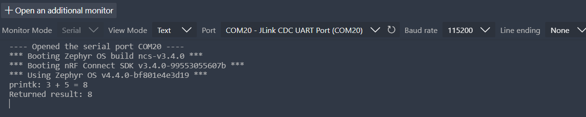

# ESE5180: Lab 0 Zephyr

| Team Member Name | Email Address                 |
| ---------------- | ----------------------------- |
| Aktilek Skakova  | skakova@engineering.upenn.edu |

**GitHub Repository URL: [skakova-aktilek/Zephyr-RTOS-build-system](https://github.com/skakova-aktilek/Zephyr-RTOS-build-system)**

#### 1. Hello (Vanilla) Zephyr

(1.1)  f26_lab0_1.1_skakova   Video is submitted

#### 2. Hello (Nordic) Zephyr

(2.1)  "2.1. Zephyr application" was commited to Git

(2.2)  f26_lab0_2.1_skakova   Video is submitted

#### 3. Building with West

**(3.1)**

***Why does Zephyr wrap CMake with West?***

West gives Zephyr a simpler interface for building, flashing, debugging, and managing multi-repository projects while still using CMake/Ninja underneath.

**West commands:**

west init — initializes a West workspace.

west update — downloads/updates projects from the manifest.

west build — configures and builds a Zephyr application.

west flash — flashes the built firmware to the board.

**Build command arguments**

--build-dir build — uses build as the build directory.

. — uses the current folder as the application directory.

 --pristine — performs a clean build.

--board nrf7002dk/nrf5340/cpuapp/ns — selects the nRF7002 DK non-secure application core.

--sysbuild — enables Sysbuild.

-DBOARD_ROOT=. — adds the current directory as a board search path.

**Flash command**

-d build — flashes the firmware from the build directory.

#### 4.1 Kconfig Implementation Details

**What are the levels of Log statements?**
The four main log levels are ERR, WRN, INF and DBG.

**What is the difference between `prj.conf` and `menuconfig`?**
`prj.conf` stores the application’s requested Kconfig settings, while `menuconfig` provides an interactive interface to view and modify Kconfig options.

**How do you check that the symbols in `prj.conf` are set after building? Why?**
Check the generated `.config` file in the build directory, for example `build/blinky/zephyr/.config`. It contains the final resolved Kconfig values after dependencies and board defaults are applied.

For this build, `CONFIG_LOG` was disabled:

#CONFIG_LOG is not set

#### 5. Device Tree (DT)

(5.1) Created a board overlay with the custom alias led5180, mapped to physical LED2. The application uses this alias to toggle LED2 every two seconds. The flash partition layout was also corrected so the application starts successfully.

(5.2) Configured Button 1 as a GPIO input and polled its state every 10 ms. Each press toggles LED2, with 30 ms debouncing to prevent multiple toggles from a single press. Holding the button does not repeatedly toggle the LED.

(5.3) Created the custom alias button5180 for Button 1 in the board overlay and accessed it using DT_ALIAS(button5180) in main.c to control LED2.

An overlay allows application-specific hardware configuration without modifying the board’s original DTS file in the SDK. It keeps changes within the project, avoids affecting other applications, and makes the configuration easier to share, version-control, and maintain across SDK updates.

#### 6. Printing vs. Logging

(6.1)

**CONFIG_SUM_PRINT=y**

