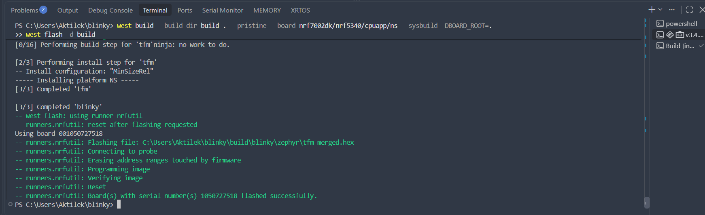

# ESE5180: Lab 0 Zephyr

| Team Member Name | Email Address                 |
| ---------------- | ----------------------------- |
| Aktilek Skakova  | skakova@engineering.upenn.edu |

**GitHub Repository URL: [skakova-aktilek/Zephyr-RTOS-build-system](https://github.com/skakova-aktilek/Zephyr-RTOS-build-system)**

#### 1. Hello (Vanilla) Zephyr

(1.1)  f26_lab0_1.1_skakova   Video is submitted

#### 2. Hello (Nordic) Zephyr

(2.1)  "2.1. Zephyr application" was commited to Git

(2.2)  f26_lab0_2.1_skakova   Video is submitted

#### 3. Building with West

**(3.1)** 

***Why does Zephyr wrap CMake with West?***

West gives Zephyr a simpler interface for building, flashing, debugging, and managing multi-repository projects while still using CMake/Ninja underneath.

**West commands:**

west init — initializes a West workspace.

west update — downloads/updates projects from the manifest. 

west build — configures and builds a Zephyr application. 

west flash — flashes the built firmware to the board.

**Build command arguments** 

--build-dir build — uses build as the build directory. 

. — uses the current folder as the application directory.

 --pristine — performs a clean build. 

--board nrf7002dk/nrf5340/cpuapp/ns — selects the nRF7002 DK non-secure application core. 

--sysbuild — enables Sysbuild. 

-DBOARD_ROOT=. — adds the current directory as a board search path. 

**Flash command** 

-d build — flashes the firmware from the build directory.

